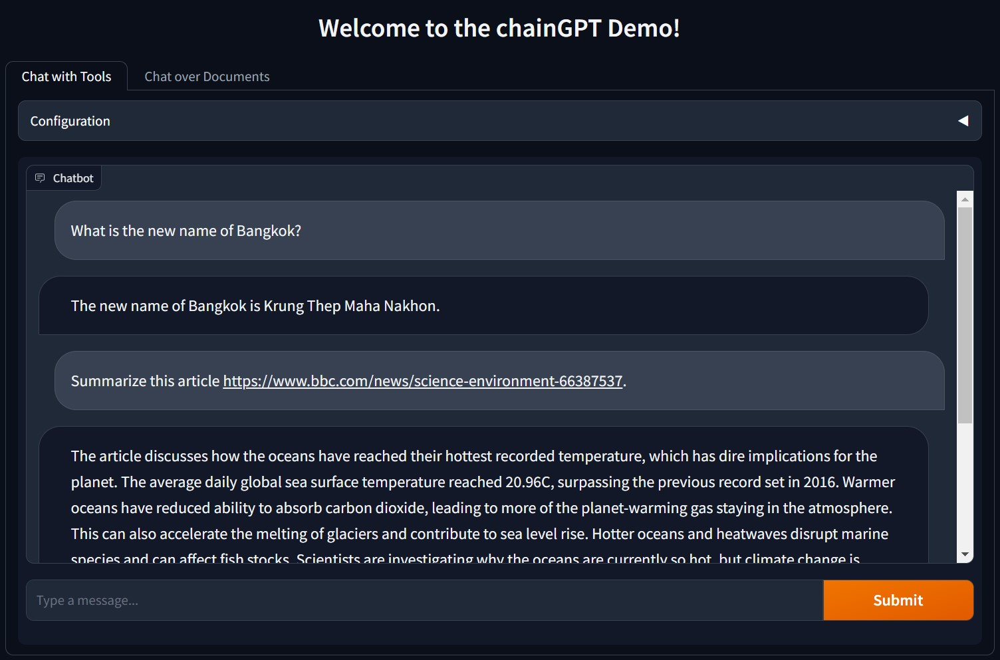

# 🔗chainGPT: Chatbot Application with LLM Integration

chainGPT is an LLM-powered Chatbot application that connects to a multitude of tools, including search API, vector database, and more. Users have the flexibility to personalize the Chatbot's persona to suit their preferences. To enhance user experience and ensure ease of use, we provide a user-friendly Graphical User Interface.



## 🚀 Features

- Internet Access for Searching: chainGPT seamlessly connects to the internet, allowing users to perform web searches and access a vast repository of information.
- Web URL Content Access: chainGPT allows users to paste a URL link in the chat, and the chatbot will automatically open the link to read and retrieve the content from the provided URL.
- Custom data uploading: chainGPT integrates with a vector database so that users can upload their own documents and chat over them.
- Python Expression Evaluator: chainGPT can access the Python expression evaluator to enhance mathematical calculation capabilities.
- Customizable Chatbot Persona: chainGPT offers users the freedom to customize the Chatbot's persona, tailoring the conversational experience to their preferences and needs.

## Quick Start

Create .env file from .env.example and fill in the required information then run the following commands:

```bash
pip install -r requirements.txt

python app.py
```
The application will be running on http://127.0.0.1:7860
